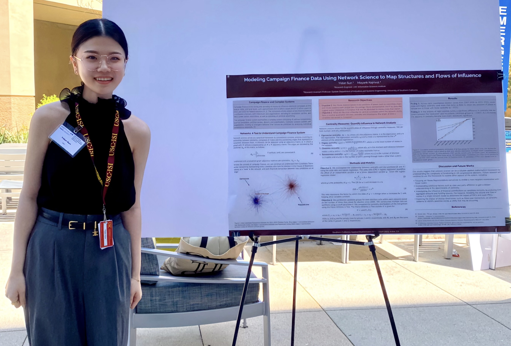

## Poster Presentation at the Southern California Applied Mathematics Symposium (SOCAMS 2023) at UC Irvine

## Presentation at the International Conference on Advances in Social Networks Analysis and Mining (ASONAM 2023) in Kusadasi, Turkey

## Received the USC Viterbi Jenny Wang Teaching Award

## Awarded the ISE Outstanding Teaching Assistant of the Year

